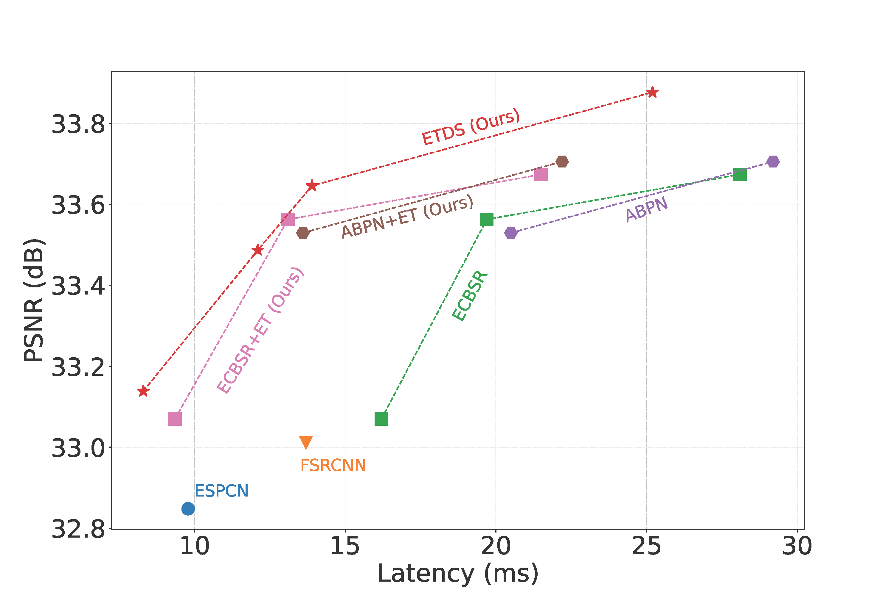
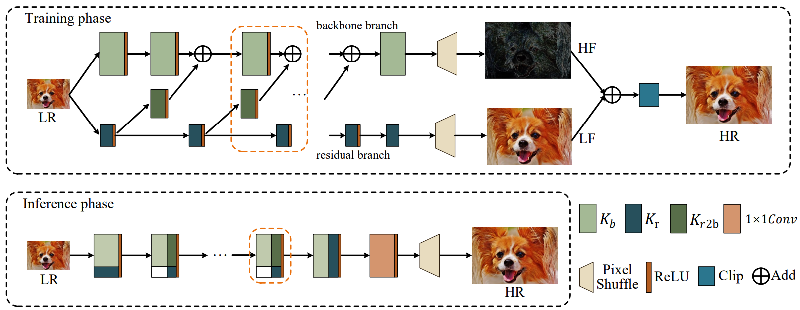
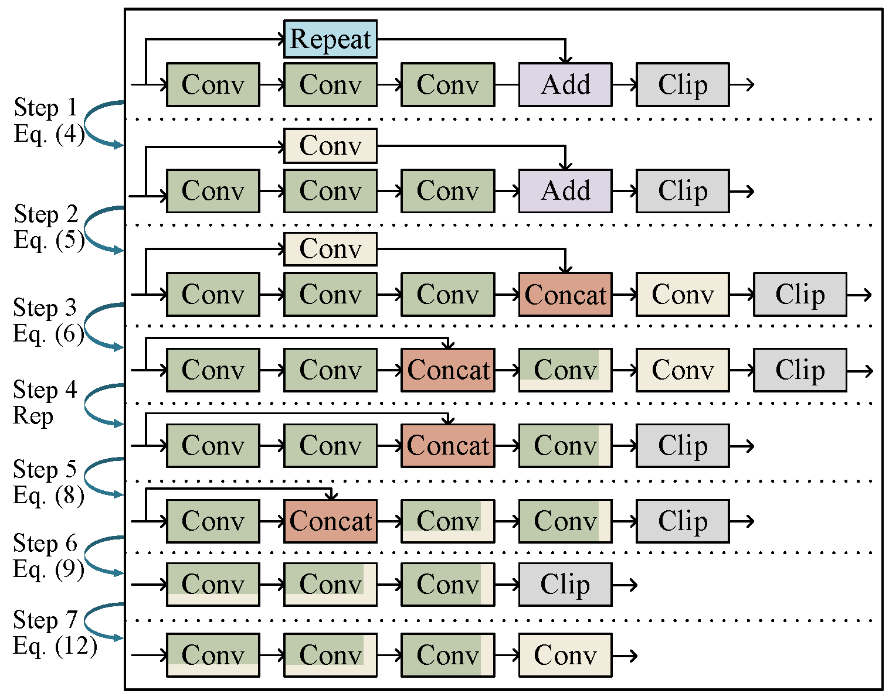
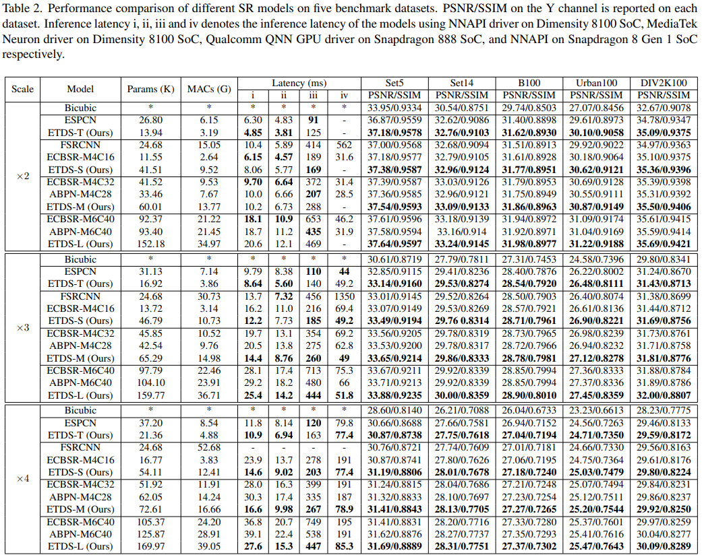
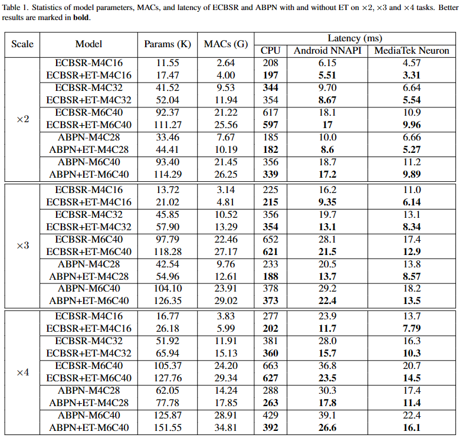
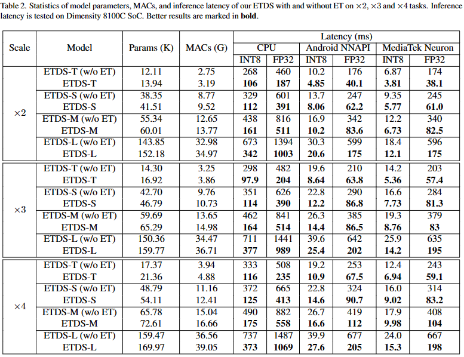

# <font color='#4CB963'>E</font><font color='#A0EADE'>T</font><font color='#5C6784'>D</font><font color='#1D263B'>S</font>: <font color='#4CB963'>E</font>quivalent <font color='#A0EADE'>T</font>ransformation and <font color='#5C6784'>D</font>ual <font color="#1D263B">S</font>tream Network Construction for Mobile Image Super-Resolution


By [Jiahao Chao](https://github.com/CCjiahao), [Zhou Zhou](https://github.com/2019zhou), [Hongfan Gao](https://github.com/hongfangao), [Jiali Gong](https://github.com/gongjiali), Zhengfeng Yang*, Zhenbing Zeng, Lydia Dehbi (*Corresponding author).

This is the official Pytorch implementation of [Equivalent Transformation and Dual Stream Network Construction for Mobile Image Super-Resolution](comming_soon).

The previous version of ETDS, [PureConvSR](https://github.com/ECNUSR/PureConvSR-AIM2022), won the third place in the Mobile AI & AIM: Real-Time Image Super-Resolution Challenge ([website](https://data.vision.ee.ethz.ch/cvl/aim22/) / [report](https://arxiv.org/abs/2211.05910)).

<center>
    
    <br>
    <div style="color:orange; border-bottom: 1px solid #d9d9d9; display: inline-block; color: #999; padding: 2px;">Comparisons of PSNR performance and the inference latency of different models.</div>
</center>

## Contents
- [<font color='#4CB963'>E</font><font color='#A0EADE'>T</font><font color='#5C6784'>D</font><font color='#1D263B'>S</font>: <font color='#4CB963'>E</font>quivalent <font color='#A0EADE'>T</font>ransformation and <font color='#5C6784'>D</font>ual <font color="#1D263B">S</font>tream Network Construction for Mobile Image Super-Resolution](#font-color4cb963efontfont-colora0eadetfontfont-color5c6784dfontfont-color1d263bsfont-font-color4cb963efontquivalent-font-colora0eadetfontransformation-and-font-color5c6784dfontual-font-color1d263bsfonttream-network-construction-for-mobile-image-super-resolution)
  - [Contents](#contents)
  - [Introduction](#introduction)
  - [Get Started](#get-started)
    - [Data preparation](#data-preparation)
    - [Training](#training)
    - [Convert](#convert)
    - [Validition](#validition)
    - [Results](#results)
  - [Core File List](#core-file-list)
  - [Citations](#citations)
  - [License](#license)
  - [Acknowledgments](#acknowledgments)

## Introduction
In recent years, there has been an increasing demand for real-time super-resolution networks on mobile devices. To address this issue, many lightweight super-resolution models have been proposed. However, these models still contain time-consuming components that increase inference latency, which limits their real-world applications on mobile devices. In this paper, we propose a novel model based on Equivalent Transformation and Dual Stream network construction (ETDS), for single image super-resolution. The ET method is proposed to transform time-consuming operators into time-friendly ones as convolution and ReLU on mobile devices. Then, a dual stream network is designed to alleviate redundant parameters yielded from the ET and enhance the feature extraction ability. Taking full advantage of the advance of the ET and the dual stream network structure, we develop the efficient SR model ETDS for mobile devices. The experimental results demonstrate that our ETDS achieves superior inference speed and reconstruction quality compared to prior lightweight SR methods on mobile devices.


<center>
    
    <br>
    <div style="color:orange; border-bottom: 1px solid #d9d9d9;
    display: inline-block;
    color: #999;
    padding: 2px;">Network architecture of ETDS during training and inference stages. The residual branch for extracting low-frequency contents only contains a few parameters, and most of the parameters are used to extract high-frequency contents.</div>
</center>

<center>
    
    <br>
    <div style="color:orange; border-bottom: 1px solid #d9d9d9; display: inline-block; color: #999; padding: 2px;">Illustration of converting the general model into the equivalent plain model using ET. The beige convolution indicates that a specific value is assigned to the convolution kernel. Rep refers to the reparameterization technique.</div>
</center>

## Get Started

### Data preparation
Like [BasicSR](https://github.com/XPixelGroup/BasicSR), we put the training and validation data under the datasets folder. You can download the data in the way provided by [BasicSR](https://github.com/XPixelGroup/BasicSR), but please note that our data path is slightly different from BasicSR, please modify the data path in the configuration file (all configuration files are under the [configs](configs) folder).

Also, under the [scripts/datasets/DIV2K](scripts/datasets/DIV2K) folder, we provide the script to download the DIV2K dataset. You can download the DIV2K dataset as follows:

```bash
bash scripts/datasets/DIV2K/build.sh
```

Finally, the structure of the dataset is as follows:

```
datasets/
├── DIV2K
    ├── train
        ├── HR
            ├── original
                ├── 0001.png
                ├── 0002.png
                ├── ...
                ├── 0800.png
            ├── subs
                ├── 0001_s001.png
                ├── 0001_s002.png
                ├── ...
                ├── 0800_s040.png
        ├── LR
            ├── bicubic
                ├── X2
                    ├── original
                        ├── 0001x2.png
                        ├── 0002x2.png
                        ├── ...
                        ├── 0800x2.png
                    ├── subs
                        ├── 0001_s001.png
                        ├── 0001_s002.png
                        ├── ...
                        ├── 0800_s040.png
                ├── X3...
                ├── X4...
    ├── valid...
├── Set5
    ├── GTmode12
        ├── baby.png
        ├── bird.png
        ├── butterfly.png
        ├── head.png
        ├── woman.png
    ├── original...
    ├── LRbicx2...
    ├── LRbicx3...
    ├── LRbicx4...
```

### Training

[train.py](train.py) is the entry file for the training phase. You can find the description of [train.py](train.py) in the [BasicSR](https://github.com/XPixelGroup/BasicSR) repository. The training command is as follows:
```bash
python train.py -opt {configs-path}.yml
```
where `{configs-path}` represents the path to the configuration file. All configuration files are under the [configs/train](configs/train) folder. The `log`, `checkpoint` and other files generated during training are saved in the [experiments](./experiments)`/{name}` folder, where `{name}` refers to the name option in the configuration file.


### Convert
ETDS during training is a dual stream network, and it can be converted into a plain model through [converter.py](converter.py), as follows:
```bash
python converter.py --input {input-model-path}.pth --output {output-model-path}.pth
```
where `{input-model-path}.pth` represents the path to the pre-trained model, and `{output-model-path}.pth` indicates where the converted model will be saved.

Also, the code of converting ECBSR and ABPN to plain models is in [converter_ecbsr_et](converter_ecbsr_et.py) and [converter_abpn_et](converter_abpn_et.py).

Our pretrained models after conversion are in the [experiments/pretrained_models](./experiments/pretrained_models) folder.

### Validition
The validition command is as follows:
```bash
python test.py -opt {configs-path}.yml
```
where `{configs-path}` represents the path to the configuration file. All configuration files are under the [configs/test](configs/test) folder. The verification results are saved in the [results](./results) folder.

### Results

<details>
<summary>Mobile Image Super-Resolution</summary>
<p align="center">
  
</p>
</details>

<details>
<summary>ETDS, ECBSR and ABPN with and without ET</summary>
<p align="center">
  
  
</p>
</details>
<!-- 
<details>
<summary>others (e.g., ECBSR and ABPN) with and without ET</summary>
<p align="center">
</p>
</details> -->

##  Core File List
This repository is based on [BasicSR](https://github.com/XPixelGroup/BasicSR)'s code framework and has undergone secondary development. Here we point out the core files of this repository (Descending order of importance):

- [core/archs/ir/ETDS/arch.py](core/archs/ir/ETDS/arch.py) : ETDS architecture
- [converter.py](converter.py) : Convert ETDS to plain model using the Equivalent Transformation technique.
- [converter_abpn_et.py](converter_abpn_et.py) : Convert ABPN to plain model using the Equivalent Transformation technique.
- [converter_ecbsr_et.py](converter_ecbsr_et.py) : Convert the ECBSR to a model with less latency using the Equivalent Transformation technique.
- [train.py](train.py) : Model training pipeline
- [test.py](test.py) : Model testing pipeline
- [core/models/ir/etds_model.py](core/models/ir/etds_model.py) : An implementation of the model interface for pipeline calls.
- [validation/reparameterization.py](scripts/validation/reparameterization.py) : Verify the correctness of the description of reparameterization in the appendix.

## License
This project is released under the [Apache 2.0 license](LICENSE.txt).

## Acknowledgments
Our code is inspired by [ABPN](https://github.com/NJU-Jet/SR_Mobile_Quantization), [ECBSR](https://github.com/xindongzhang/ECBSR) and [BasicSR](https://github.com/XPixelGroup/BasicSR).
